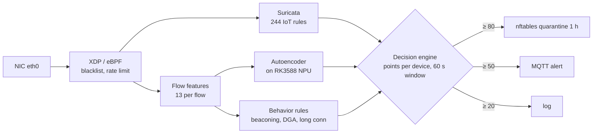

# IoT Security Gateway

A small box that sits in front of IoT devices, inspects every packet, and cuts off a device automatically when it starts behaving like it has been hacked. Runs entirely on an Orange Pi 5 (RK3588S), with ML inference on the board's NPU and no cloud.

## What it does

Cheap IoT devices (cameras, plugs, routers) rarely get security updates, which makes them easy targets for botnets like Mirai. This gateway watches their traffic and stacks four kinds of detection:

1. **Kernel filtering (XDP/eBPF)**: drops blacklisted hosts and floods inside the network driver, before Linux even builds a packet.
2. **Signature IDS (Suricata)**: 244 custom rules for IoT attacks, such as Mirai payloads, default-credential logins, firmware exploits, MQTT/CoAP/Modbus abuse and C2 traffic.
3. **Anomaly detection on the NPU**: each network flow becomes 13 numbers. An autoencoder running on the RK3588 NPU flags flows it cannot reconstruct well.
4. **Behavior rules**: periodic "beaconing" to a command server, long-lived hidden connections, and random-looking (DGA) DNS names.

Every signal adds points to the device that caused it. If a device collects **80 points within 60 seconds**, it is quarantined with nftables for an hour and an MQTT alert is sent.

## Results

Stress test v8 (2026-04-02, 47 minutes, 9 attack phases from recon to DNS C2):

| Metric | Value |
|---|---|
| Attack phases detected | 9 / 9 |
| Expected Suricata rule IDs that fired | 87 / 88 (98.9%) |
| Alerts raised | 1,551 |

Full report: [`docs/results/stress_test_v8.md`](docs/results/stress_test_v8.md). It also lists rules that fire inconsistently across runs.

## How it works



| Signal | Points |
|---|---|
| Suricata severity 1 / 2 / 3 | 50 / 30 / 10 |
| NPU anomaly (high confidence) | 40 (60) |
| Beaconing | 35 |
| Long-lived connection | 25 |
| DNS anomaly | 20 |

Inference falls back automatically: RKNN on the NPU → ONNX on the CPU → scikit-learn random forest. The gateway keeps running without the NPU.

A Flask dashboard on port 5000 shows live alerts, device scores and quarantines. It also has buttons that launch the bundled attack simulators against a test device.

## Quick start

This is a hardware appliance, so it needs an Orange Pi 5 (RK3588/RK3588S) with Suricata 7 built on the device. [`INSTALL.md`](INSTALL.md) has the full setup. After that:

```bash
cp configs/gateway.env.example gateway.env   # set interface, gateway IP, test device IP
source gateway.env
./gateway.sh start      # XDP → Suricata → MQTT → detection pipeline → dashboard
./gateway.sh status
./gateway.sh test       # end-to-end check
./gateway.sh stop
```

Useful controls:

```bash
xdp/scripts/xdp_control.sh block <IP>     # drop an IP in the NIC driver
scripts/quarantine.sh list                # show quarantined devices
scripts/quarantine.sh remove <IP>
```

## Project structure

```
gateway.sh              start / stop / status / test for the whole stack
xdp/src/xdp_gateway.c   XDP program: blacklist, SYN/UDP rate limit, flow tracking
ebpf/                   Suricata-side eBPF bypass filter
rules/                  244 custom Suricata rules in 16 files
scripts/
  detect_pipeline.py    packet sniffer → flow features → NPU → behavior rules
  flow_features.py      the 13 flow features
  npu_detector.py       RKNN → ONNX → sklearn fallback chain
  npu_infer.c           C bridge to the RKNN runtime
  decision_engine.py    evidence scoring and quarantine
  attack_*.py / .sh     attack simulators: port scan, floods, ARP spoof, C2, UPnP, brute force
models/                 trained autoencoder, classifier, random forest + training scripts
dashboard/app.py        Flask dashboard
configs/                Suricata, nftables, systemd and logrotate configs
docs/                   development history, test results, slides
```

## Limitations

- **Lab use only.** The dashboard has no login and can start attack scripts with sudo. Keep it on an isolated test network.
- The models were trained on NSL-KDD and synthetic flows (`scripts/generate_dataset.py`), not traffic from a real home network. Accuracy after INT8 quantization has not been validated separately.
- The autoencoder is tiny (13 → 8 → 4 → 8 → 13), so it barely loads the NPU. The NPU path exists to show the full pipeline, not because the CPU couldn't keep up.
- The Suricata eBPF bypass is built but disabled; enabling it needs Suricata rebuilt with `--enable-ebpf`.
- [`docs/DEVELOPMENT_STAGES.md`](docs/DEVELOPMENT_STAGES.md) tracks the open items.

## License

MIT, see [`LICENSE`](LICENSE).
